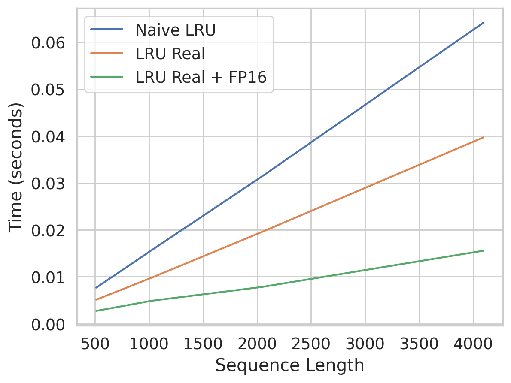

# Real LRU

This repository contains an implementation of the [Linear Recurrent Unit](https://arxiv.org/abs/2303.06349) using real numbers for computation.
## Motivation

In today's world, training large models requires a significant amount of computation. We can reduce training time by employing AMP training. To encourage research in finding alternative architectures for Large Language Models, it is essential to speed up training and bring LRU on par with the training times of transformers.

## Experiments

Results obtained by running `bench.py`.

## Plan

- [x] Mixed Precision computation
- [x] Materializing $\Lambda$ through real numbers
- [ ] Simple LM with LRU
- [ ] Wikitext trained model
